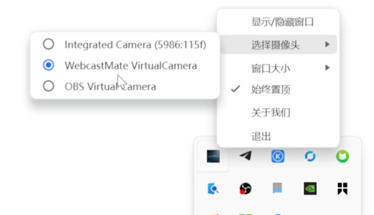
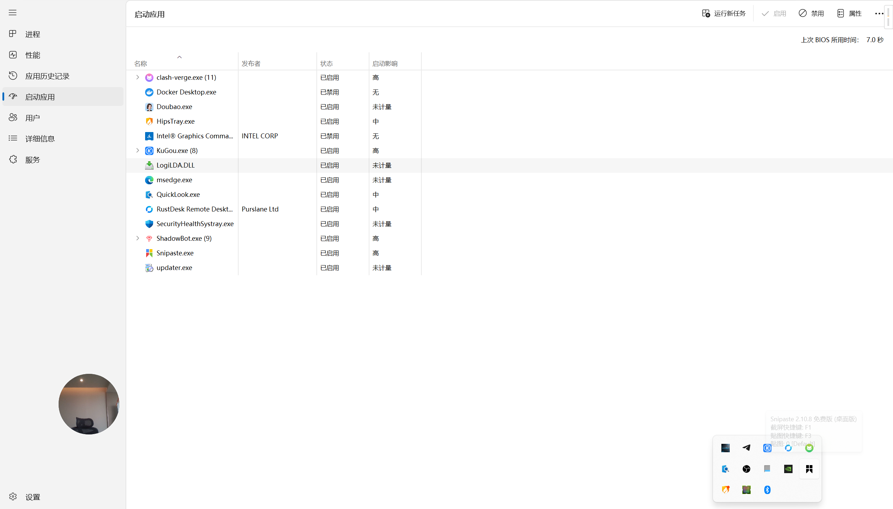
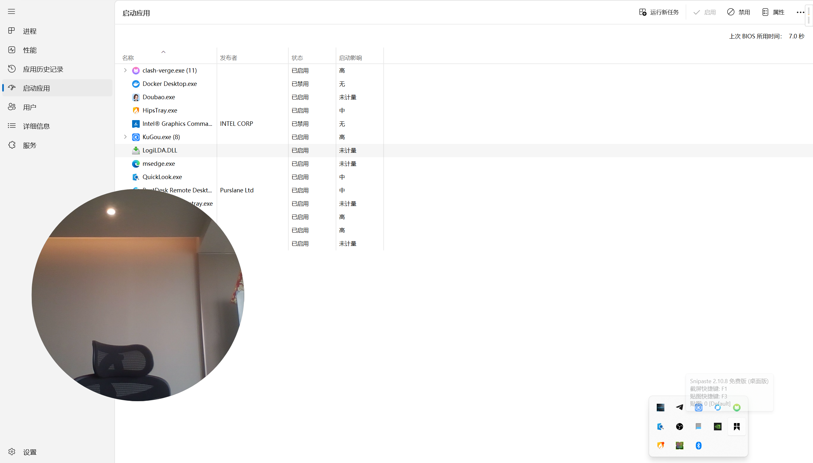
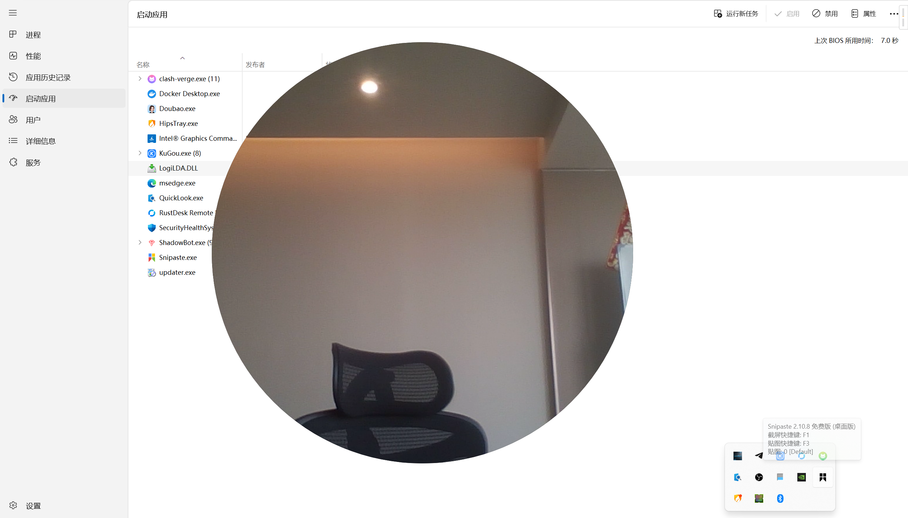

# mini-camera - 使用说明

仅保留必需的使用步骤，便于快速上手。一款简洁、美观的圆形悬浮摄像头小工具，支持切换不同的摄像头，支持鼠标滚动自动调整大小，鼠标拖动位置，方便在直播或者录屏的时候使用，不知道是否需要mac版本 有需要可以上
# 下载方式
直接在右侧release下载，双击解压后使用

## 环境要求

- Windows 10/11
## 使用截图

- 切换摄像头

  

- 小

- 中

- 大

## 支持作者

为爱发电，持续更新中（得有人愿意使用），如本工具对你有帮助，欢迎赞赏支持（谢谢！）。作者肄业还房贷，为爱发电中，您的支持是我持续维护更新的动力。

| 微信 | 支付宝 |
| --- | --- |
|  |  |

